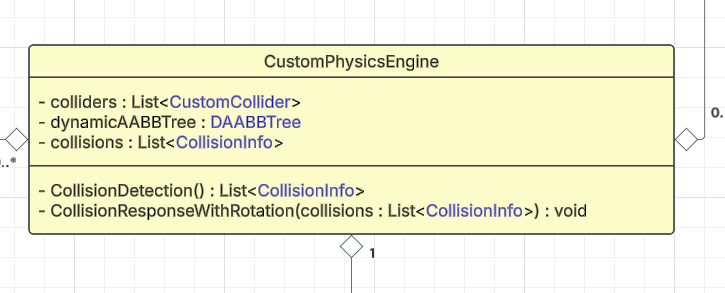
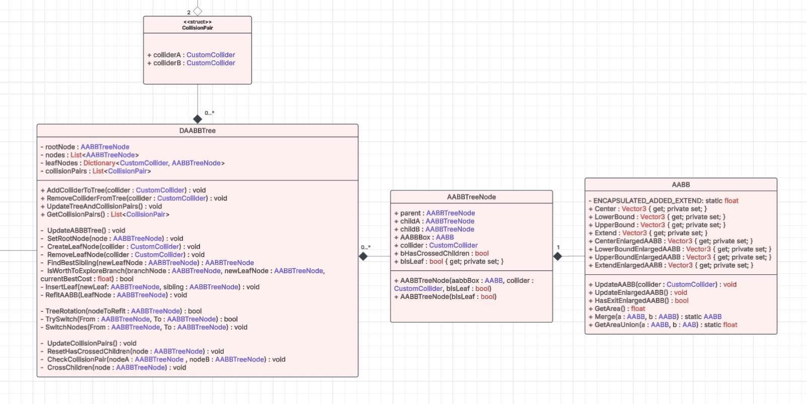
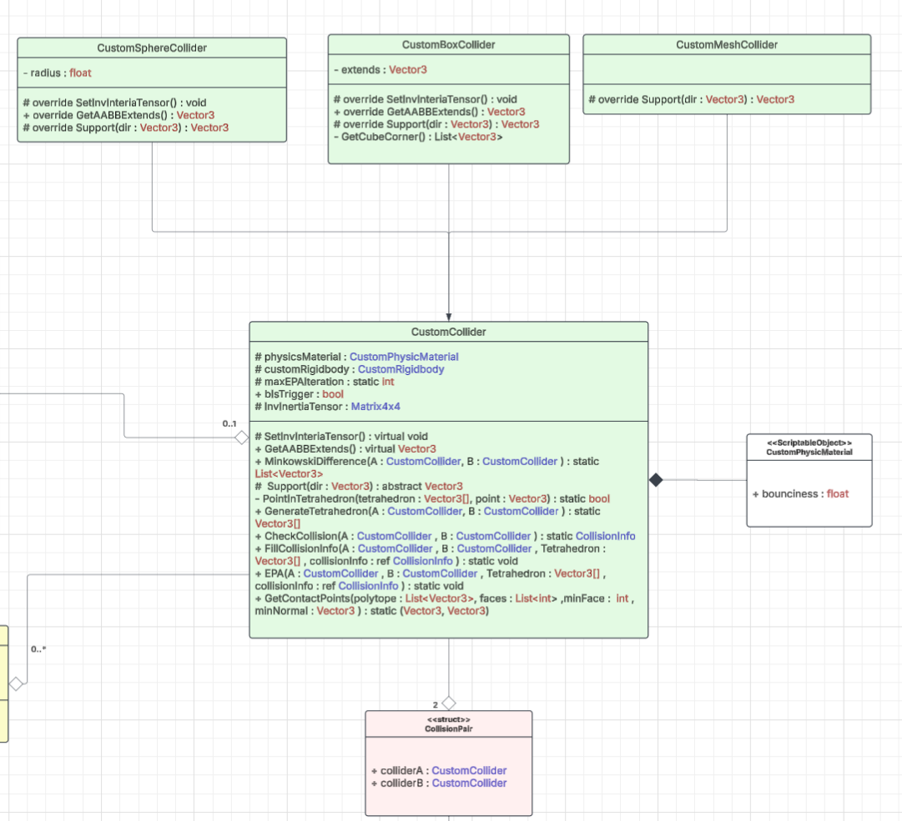
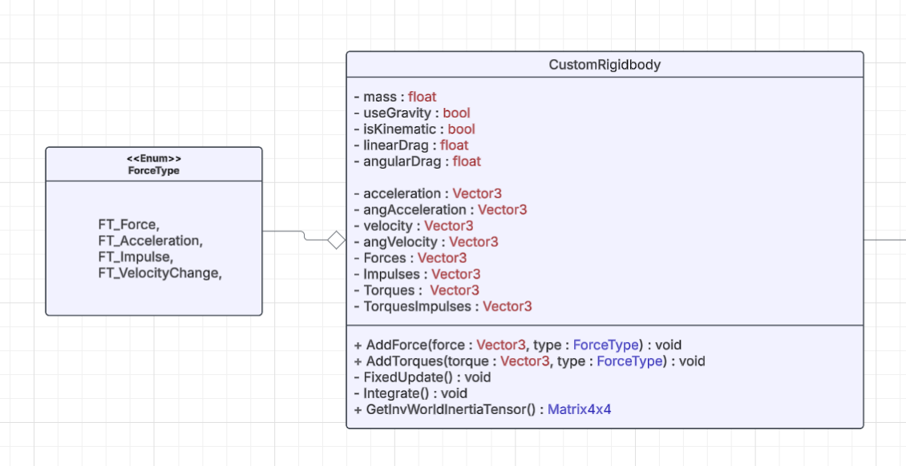
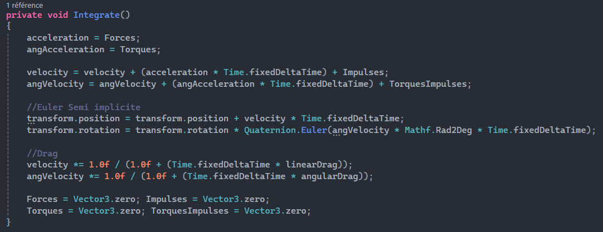
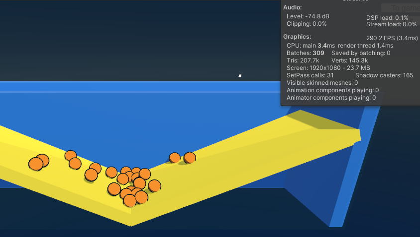
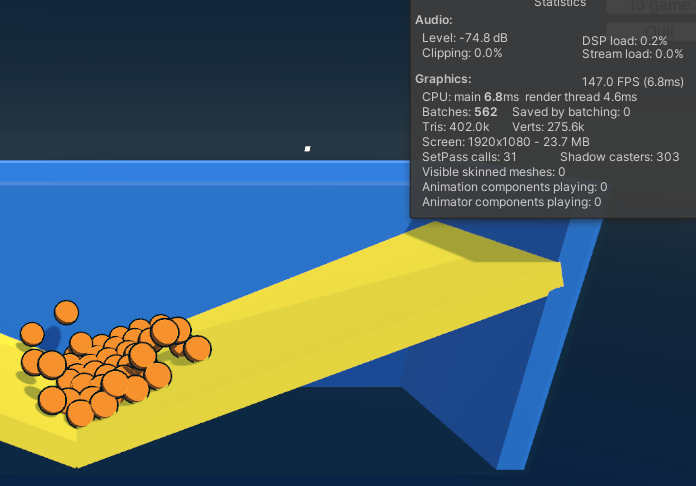
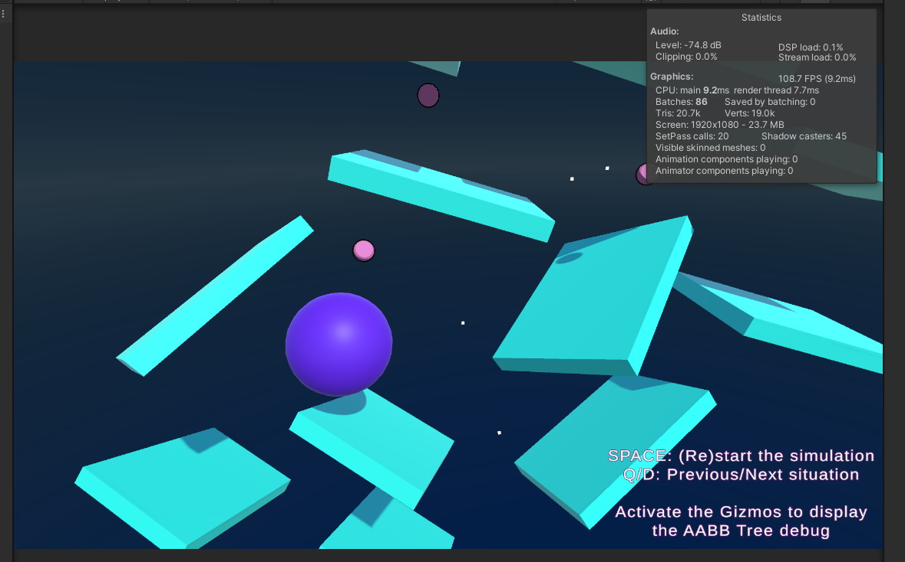

# Physics Engine

## 1) Introduction
Physics Engine is a project focused on implementing the different parts of a Physics Engine, such as the Broad Phase, the Narrow Phase, and collision responses. 

Full UML Code Architecture Link: [UML](https://lucid.app/lucidchart/59c73029-5fdf-4a35-b050-fcdce39dd273/edit?viewport_loc=-126%2C2%2C2645%2C1374%2C0_0&invitationId=inv_a540ee50-39be-4307-bc32-6a1a3db9803e)

The main class of the engine is the CustomPhysicsEngine, which performs collision detection (the Broad phase and the Narrow phase) and collision responses.  
  
<i>Custom Physics Engine class</i>

## 2) Broad Phase - Dynamic AABB Tree

A dynamic AABB tree is used to perform the Broad Phase, which detects which colliders can potentially collide.   
This avoids performing the real collision detection algorithm between every collider, which would cause performance issues. 
  
<i>UML of the Dynamic AABB Tree</i>

The Dynamic AABB tree (DAABBTree class) uses the AABBTreeNode class containing the AABB box used to encapsulate colliders. A binary tree is used to regroup the AABBs into bigger AABBs by merging them.   

When a new collider is detected, it is inserted directly into the dynamic AABB tree as a leaf AABBTreeNode using the Branch-and-Bound algorithm to find its best sibling. 
The chosen sibling is the one that will add the lowest cost to the tree, which means the lowest added surface area. 
The algorithm recursively explores the tree and can skip sub-branches if it detects that those branches cannot provide the best result.
When adding a node, areas of the inserted box and its sibling are merged, creating the parent AABB box. AABB of its predecessors are refitted to keep the tree and areas up to date.   

To solve the sorted input problem that would cause a bad tree computation, we implemented tree rotations that will optimize the tree surface area by swapping some branches. 
Tree Rotations are applied during the refitting step.  

To avoid performance issues, the AABB tree is not recomputed every frame. Instead, colliders have an enlarged fixed AABB box surrounding them.
When moving and leaving the enlarged AABB box, the collider is removed from the Dynamic AABB tree and reinserted with its updated enlarged AABB box.  

  
<i>Dynamic AABBTree Boxes 
Blue boxes are the AABB and Merged AABB of the Dynamic Tree 
Green boxes are the enlarged AABB of the colliders 
The collider AABBs become red when colliding. </i>

At the end of the broad phase, the CheckCollisionPair function is called and cleverly crosses the tree to find all the possible collision pairs needed to be tested by the collision detection algorithm. 
Checking the intersection of AABB Boxes is much less costly than performing the real collision detection algorithm.  

## 2) Narrow Phase - GJK & EPA
### A) Custom Colliders
We made our custom collider by creating a simple code architecture with a main abstract class that declares all statics and primary methods that will be used, like GJK or EPA. 
Inherited classes' purpose is to override the support function. The support function is a method with a direction as input and a point as output. The returned point is the farthest one on the shape in the given direction. This method is used in the collision detection algorithm. 
In our case, we made 3 custom colliders, the sphere and the cube colliders with optimal support function for those shapes, and a mesh collider gathering a point using a less efficient but precise algorithm. 
This allows us to use simple but faster collision detection, or a more precise one when it's required. 
  
<i>Sphere and Box colliders</i>

### B) GJK
The GJK algorithm (for Gilbert-Johnson-Keerthi algorithm) is a really efficient collision testing algorithm for convex shapes. 
Implementing it requires creating a static method in our colliders that tests the collision between two colliders and returns a structure with all useful collision data we will need, such as the contact point, the normal of the contact, and the penetration.  

The algorithm in itself works using Miwhosky’s difference of two shapes we want to test, and checking if it contains the origin (0,0,0). 
To do so, and using the supports function, we generate tetrahedrons with points on this shape, checking if the origin is in this simplex, and if no, we iterate with a smaller one by removing the first point and replacing it with a new calculated one, until we found a collision, recalculate the same tetrahedron twice, recalculate a point in the last one, or reached our iteration limit.  

If we detect a collision, we save the last tetrahedron and give it to the EPA algorithm to gather all collision information.  

### C) EPA & Contact points
Once the GJK has detected that a collision occurs between two objects, we used the Expanding Polytope Algorithm to compute collision data such as the normal of the collision, the penetration depth, and the collision points of the two objects.  

This algorithm starts with the last Tetrahedron used during the GJK. It will add vertices to the tetrahedron that will become a polytope to find the closest face of the original object from the origin. With this closest face, we can compute the normal of the collision as well as the collision depth.  

For the contact points, we can take the closest triangle found by the EPA and project the origin onto it to find the contact point. We then calculate the barycentric coordinate of the contact point. 
To get the contact point in world space for both of the objects, we had to store the support function results of both colliders for each point inside the polytope when creating them. By reusing the same barycentric coordinates as coefficients with the stored support results for the 3 points of the closest triangle, we can linearly find the contact point in world space for both colliders.  

  
<i>UML of the Colliders - GJK - EPA</i>  

## 4) Rigidbody & Collision Response
### A) Rigidbody

To perform the collision response, we create our own CustomRigidbody class. 
  
<i>UML of the RigidBody class</i>

The first 5 variables inside the CustomRigidbody are editable directly in the editor.  
The AddForce and AddTorque functions update the Forces, Impulses, Torques, and TorquesImpules vector used during the FixedUpdate integration. It uses a ForceType to tell the engine if the force added is a force or impulse, and if it should take into account the mass of the rigidbody or not.  
During the Integration, the acceleration and angular acceleration are computed.  
The velocity and angular Velocity are then updated as well as the position and rotation with the Semi-Implicit Euler Integration.  
We also added drag and angular drag during the integration and called an AddForce for the gravity during the FixedUpdate before the integration.  

  
<i>Rigidbody Integration using Semi-Implicit Euler integration</i>

### B) Collision Response

Collisions are resolved once all the collision tests have been done. The collision response is made in the CollisionResponseWithRotation function inside the CustomPhysicsEngine class.  
It firstly checks the relative velocity of the objects to see if they go in the opposite direction, or not, to avoid performing the collision responses during multiple frames.  
The position correction is then made depending on the collision normal, penetration, and the mass of the objects, as well as an editable damping variable.  
Then the momentum and weights of the objects are calculated thanks to the contact points, the collision normal, and the inverse world tensor of both objects.  
Finally, we can compute the impulsion for both objects using their weights, mass, bounciness contained in the physics material, and relative velocity.  
The velocity and angular velocity are then updated for both objects.  

## 5) Performances
### A) Objects count

  
<i>This scene with 24 balls colliding together and with some grounds and walls runs at nearly 300fps</i> 

  
<i>This scene with 48 balls colliding together and with some grounds and walls runs at nearly 150fps.</i> 

It shows that performing the collision detection and response has an impact on performance when having multiple colliding elements. By doubling the number of objects, we doubled the CPU tick time. It needs optimization to run well when having a lot of objects. 

### B) Dynamic AABB Tree

  
<i>Without using the AABB tree and checking collisions between each object, this scene drops to 130fps.  In this case, it was even worse because the collisions were checked twice between each object (between A-B and B-A)</i> 

  
<i>By using the Dynamic AABB tree this scene goes up to 515 fps.  It even goes up to 600fps by not checking collisions between two objects without rigid bodies that haven’t moved. It shows that the Broad Phase is essential to optimize the physics engine</i> 

## 6) Possible Improvements
- Compute collision detection in GPU (using compute shader)
- Generate Multiple contact points in order to stabilize rotations.
- Apply static and dynamic friction
- Add the ability to lock translation and rotation on a given axis
- Add more collider shapes
- Add more delegate events (OnColliderEnter/OnColliderExit…)
